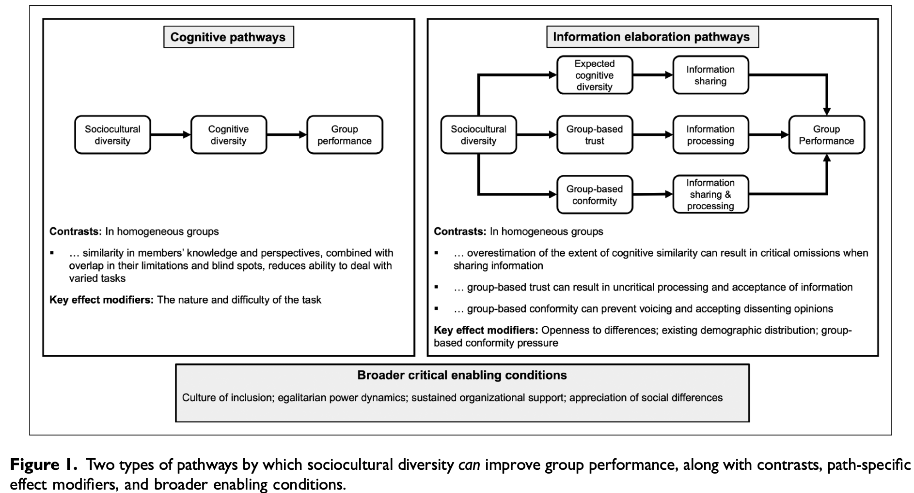
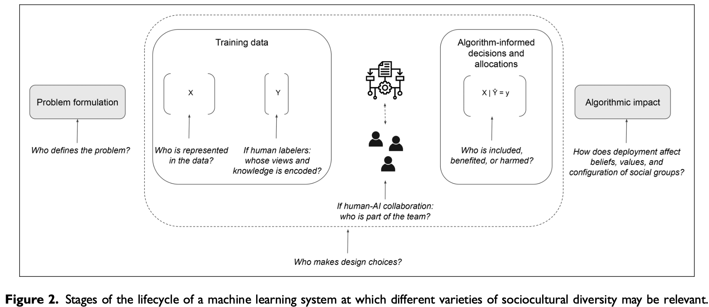

# Diversity in Sociotechnical Machine Learning Systems (Fazelpour & De-Arteaga, 2022)

## Content & Argument
* Examines the role of **sociocultural diversity** in machine learning (ML) systems.
* Identifies a **gap** between ML research on diversity (often reduced **to numbers or dataset variety**) and broader philosophical/social science understandings of diversity.
* Introduces a taxonomy of diversity concepts:
  * **Egalitarian**: equal representation of groups.
  * **Representative**: mirroring a reference population.
  * **Normic**: emphasizing inclusion of historically marginalized groups.
* **Discusses** mechanisms by which diversity benefits groups:
  * **Cognitive pathways**: diverse knowledge/perspectives lead to better problem-solving.
  * **Information elaboration pathways**: diversity reduces groupthink, encourages dissent, and improves critical discussion.

* Applies these ideas to the **ML lifecycle** (problem formulation, data collection/labeling, design, development, deployment).
* Emphasizes that diversity interventions should not be **performative** (e.g., hiring for optics only) but grounded in specific goals and mechanisms.

## Conclusions
* Diversity is **not one-dimensional**; different contexts require different concepts.
* Benefits of diversity are **potential, not automatic**—they depend on enabling conditions (e.g., inclusion, openness, support).
* Calls for **clearer conceptual grounding** in ML diversity initiatives, to avoid mismatched aims and ineffective practices.

## Keywords & Meanings
* **Diversity**: Differences among groups/individuals, defined along social (e.g., gender, race) or epistemic (knowledge, perspectives) dimensions.
* **Sociotechnical systems**: ML systems embedded in social, cultural, and organizational contexts, not just technical artifacts.
* **Algorithmic bias**: Systematic unfairness in ML outputs due to skewed data or design.
* **Egalitarian/Representative/Normic diversity**: Different ways of defining what “counts” as a diverse group (balanced distribution, population matching, or centering marginalized groups).
* **Cognitive diversity**: Varied knowledge, skills, and perspectives that improve collective problem-solving.

# Located Accountabilities in Technology Production (Suchman, 2002)

## Content & Argument
* Draws on **feminist theories of knowledge** (esp. Donna Haraway’s “situated knowledges”) to rethink **objectivity and design**.
* Critiques the dominant **“view from nowhere”** in design:
  * Designers see themselves as neutral, detached creators.
  * Users are treated as passive recipients.
* Proposes **“located accountability”**:
  * Recognizing that all knowledge and design is **situated** (from a perspective, partial, embodied).
  * Designers must **acknowledge their position** and responsibility within sociomaterial relations.
* Discusses three design stances:
  * **View from nowhere** → false neutrality, erases responsibility.
  * **Detached intimacy** → designers embedded in corporate/professional culture, but detached from real users.
  * **Located accountability** → acknowledges mediation, responsibility, and situated knowledge.

* Argues that useful systems emerge from **boundary-crossing**: designers and users must co-create, with multiple voices included.

* Example inspirations: Scandinavian participatory design traditions.

## Conclusions
* **Objectivity** in design is not neutrality but accountability: knowing one’s standpoint and being responsible for it.
* Technology design should move from being **top-down and abstract** to **situated, participatory, and accountable**.
* Calls for feminist politics in design: **inclusion, responsibility, and recognition of power relations** in tech production.

## Keywords & Meanings
* **Situated knowledges**: All knowledge is partial, located in context, and must be acknowledged as such.

* **Accountability**: Taking responsibility for the social/material consequences of design, not hiding behind neutrality.

* **Designer/user opposition**: Traditional view that separates experts from lay users; Suchman argues it’s a false divide.

* **Boundary-crossing**: The work needed to connect design and use, across cultural/professional/geographical divides.

* **Located accountability**: An ethical stance for design, grounded in recognizing one’s situated perspective and responsibility.