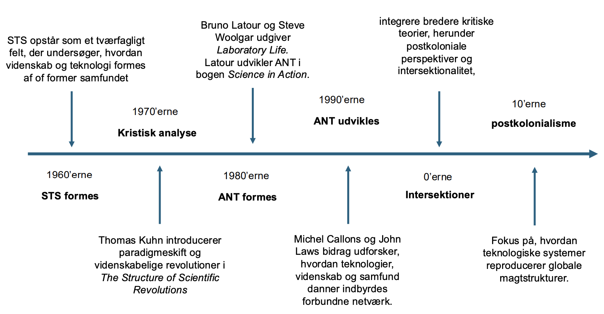
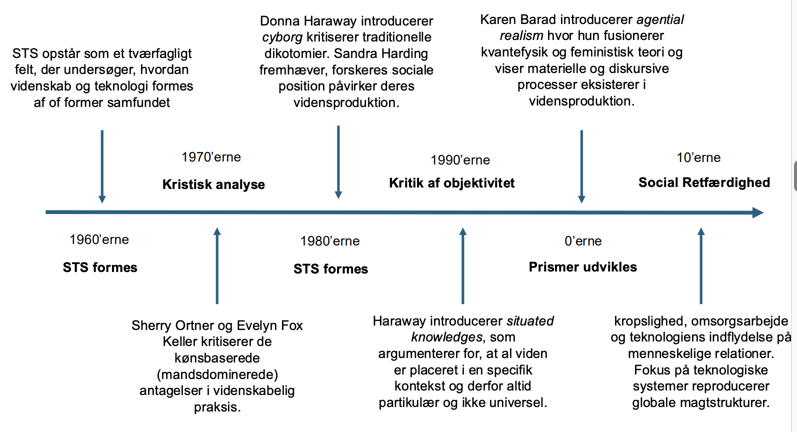
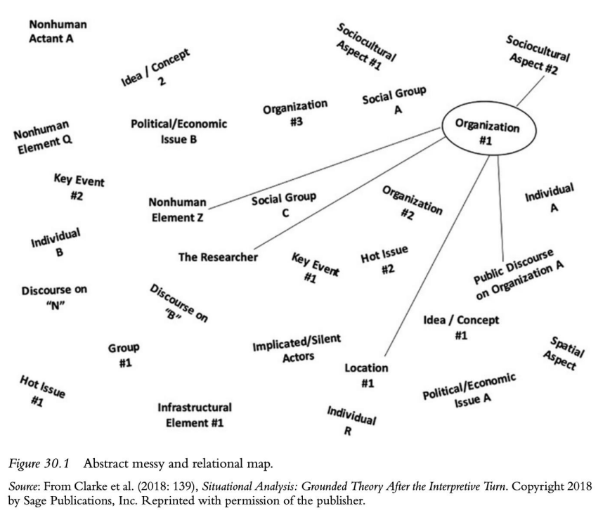

# Den ontologiske vending

## Kultivering af verden skaber skift i tænkning, metodologi og dominans

> **Ontologi**:
> Vi konstruerer viden ved at undersøge, **hvordan virkeligheden grundlæggende er struktureret**, **hvad der eksisterer**, og **hvordan forskellige former for eksistens forholder sig til hinanden**. Dette kræver en dybere forståelse af væren og eksistens (ontologi), som handler om at afdække de fundamentale principper og forhold, der udgør verden.

> **Den ontologiske vending**:
> En teoretisk bevægelse i antropologi og samfundsvidenskab, hvor *fokus skifter fra at forstå andres verdensbilleder som fortolkninger af én virkelighed til at tage deres verdener seriøst som reelt eksisterende* – altså som ontologisk forskellige virkeligheder.

Ontologi:
* Væren
* Mægnden at det der er (objekter, personer, egenskaber, relationer)

Eksempel:
* Tastatur er forskelligt fra land til land. Der er forksellige egenskaber ift. hvilke alfabeter vi bruger.

> Der findes ikke ét verdenssyn på ontologier, men tværtimod, der er mange forskellige verdensyn.

### Kloden drejer og skaber vendinger/turns i tænkning, metodologi og dominans.

* **Bølger**:
  * *Sekventiel* og *evolutionær*, hvor en bølge bygger videre på eller reagerer på den forrige.
  * *Eksempel*: HCI fire bølger: 
    * 1. Teknisk forståelse, 
    * 2. kognitiv forståelse, 
    * 3. etnografisk forståelse, 
    * 4. human-centreret forståelse (E.g., Bødker, 2015).
* **Brydninger/nybrud**:
  * *Overtrædelse* eller *omdefinering* af etablerede normer, metoder eller kategorier inden for et felt
  * Eksempel: brydning af «normaliseringer» i diskurser som feminisme (Berliner, 2022)
* **Paradigmeskifte**:
  * Et *fundamentalt skift* i, hvordan vi konceptualiserer vidensarbejde - der sker på tværs af akademiske discipliner (Gullion, 2018).

> **Argumenter imod den ontologiske vending** 
> * Den indebærer en risiko for at skabe en slags *pseudo-debat* eller *pseudo-aktivitet*, hvor man bruger en masse energi uden egentlig formål – og det sker ofte på bekostning af konkrete, empiriske studier (Aspers, 2015).
> * *Ontologi er bare et andet ord for kultur* (Venkatesan, 2010).
> * Den ontologiske vending er "kommet for langt væk fra opfordringen om at tage andre verdener seriøst, og er i stedet begyndt at opfinde deres egne verdener" (Heywood, 2012: 144).

## Aktør-netværksteori (ANT) som forløber
Aktør-netværk teori (ANT):
* **Aktanter**: mennesker og ikke-mennesker som "aktanter” Der er ingen skarp adskillelse
* **Relationel ontologi**: aktanter har ikke faste eller iboende egenskaber. Deres identitet og agens opstår gennem deres relationer og interaktioner med andre aktanter i et netværk.
* **Netværk**: Virkeligheden opfattes som en serie af netværk sammensat af forbindelser mellem aktører. *Disse netværk er i konstant forandring, da nye relationer dannes, og gamle forsvinder*. Ifølge ANT er virkeligheden et resultat af stabiliseringen af disse netværk, som altid er i proces med at blive skabt og genskabt.

## Ontologisk vending i Science and Technology Studies (STS)
> **Ontologisk vending i STS**:
> […]repræsenterer et nybrud som er relevant for fagområder, der inspireres af STS forskningen. Jeg tænker her på sociologi, antropologi, arkæologi, filosofi, informations- og medievidenskab, datalogi, pædagogik, design og domænespecifik forskning, som sundhedstjenesteforskning, **hvor studier af tekno-videnskabelige verdener finder sted**.

> Probably, the contribution for a next wave or wavelet will come from the results of an interesting discussion among several researchers and professors (Lopes, 2022)

Eksempler med hvordan STS har udviklet sig:
* Vi lære hele tiden nye ting med vidensudvikling- og deling.

* Hvordan STS fremstår og udvikler sig

* Feministike studier under STS.

### Hvad vender vi væk fra?
> **Udfordringen af det skarpe skel mellem teori og empiri**
> Den ontologiske vending markerer et brud med den traditionelle idé om, at teori udelukkende fungerer som en forklaringsmodel. I stedet bliver teori set som en aktiv deltager i tilblivelsen af verden, hvilket betyder, at teori og empiri (og praksis) gensidigt påvirker hinanden. 
> *Teori bliver dermed en del af analysens virkelighedsskabelse*.

> ”way of doing ontology as it is a way of deflatin mundane and by making it multiple” (Sismondo, 2015)
> * hvordan videnskabsfolk og ingeniører arbejder med ”matter”, og hvordan fænomener og laboratorieobjekter kan overføres til nye kontekster.
> * hvordan handlinger og praksisser skaber nye verdener.
> * **Fokus på ontologi som en proces i konstant bevægelse**.

## Domesticering som analytisk begreb
> **Domesticering**:
> Ordbog: tilpasse dyr (eller planter) til menneskers nærværelse med henblik på at udnytte dem til forskellige formål; gøre til husdyr.

### Liens eksempel (cf. Winthereik, 2015)
* STS: Mere end tæmning af dyr: at undersøge de materielle og symbolske processer, der får noget (f.eks. Laks) til at blive en del af menneskelige verdener. 
* Sammenligninger som åbner nye forbindelser: Domesticering bruges til at skabe overraskende sammenligninger på tværs af arter og praksisser, som giver nye måder at forstå og forbinde begreber, data og felter.

* Lien insisterer på, at teori ikke står uden for det, hun undersøger. Begreber som domesticering er midlertidige udgangspunkter, der både former og formes af feltarbejdet.
* Verdensskabelse gennem analyse.
  * Når hun ændrer fortællingen fra “undslupne laks” til “hullede net”, viser hun, at analyser selv skaber virkeligheder (et centralt træk ved den ontologiske vending)

### Silverstone (cf. Dourish, 2010): teknologi
> Fra ny og ‘magisk’ til hverdagslig og usynlig: Domesticering beskriver processen, hvor ny teknologi langsomt bliver en del af hverdagslivet. 
> Det omfatter trin **hvor teknologien gradvist går fra at være ny og kræve opmærksomhed til at blive en stabil**, næsten usynlig del af daglige rutiner.

* Teknologier tilpasses eksisterende infrastrukturer, relationer og vaner.

Afsløring gennem brud og vedligeholdelse: Selvom teknologien i det daglige kan forsvinde i baggrunden, bliver dens tilstedeværelse tydelig igen, når den bryder ned eller kræver vedligeholdelse.
* Ekspempel med stolen. Vi automatisk sætter os ned på stolen uden at tænke over om den er i stykker og tænker ikke mere om det. Men hvis vi sætter os og den går i stykker bliver vi hvertfald opmærksom på det.

## Situational Analysis som startskud 
Fra grounded theory, hvor alle elementer i en situation skal analyseres, da de er med til at konstituere selve situationen

**Hvordan kan vi finde frem til aktanter og netværk?**
Messy map:

**Øvelse med Wegovy**:
* Aktører:
  * Patient support solution (PSS)
  * Fitness folk
  * Poltikere
  * Social medier
    * Er det en skam at være tyk.
    * Influencer som forklarer og opfordre folk til at bruge det
  * Økonomi
    * Dyrt produkt
    * Klasse forskelle?
  * Fødevar industri
    * Lifehack til at spise McD??

## Takeaways
* Kultivering af verden skaber skift i tænkning, metodologi og dominans – kan skabe en ontologisk vending
* Den ontologiske vending i antropologi har medskabt nye måder at se ting i verden
* ANT og STS er udviklet på dette vidensgrundlag
* Som studerende er det vigtigt at være bevidst om, hvor man selv står mellem teori og empiri: at tage andre verdenssyn alvorligt uden selv at miste fodfæstet i virkeligheden
* Vær kritisk og reflekter over, hvad anvendte begreber og perspektiver gør ved det, I studerer.