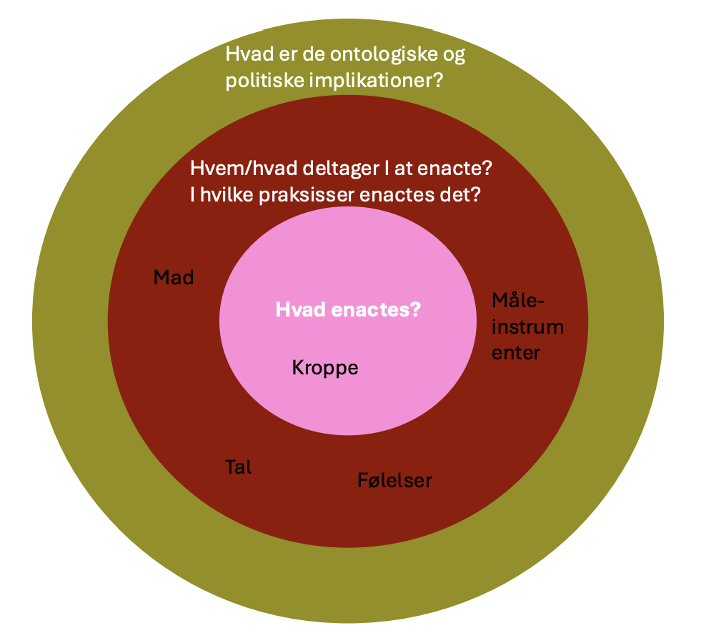

# Enactede kroppe & Re-konfigurerede patienter

Krop som enacted & multipel

**Aktør netværk teori:**
* For at forstå et fænomen eller en aktør, bliver vi nødt til at forstå den ift. dens netværk (relationer). 
* Der er ikke én stabil verden, men der er hele tiden nye relationer.

**Begreber**
(til at analysere &/eller diskutere med)
* Enactment
* Ontologisk politik
* Multiplicitet
* Re-konfiguration
* Usynligt arbejde

## Den enactede krop
**Definition**: At performe, at gøre. Tilblivende virkelighed.
* Der er politiske intensioner om hvordan noget bliver performet.
* Kroppen er ikke en singulær, men kroppen bliver til og formet i praksis.
  * Derfor siger man at kroppen er *mulitple*, da den kan performes på forskellige måder. 

> “It is possible to say that in practices objects are **enacted**. This suggests that activities take place – but leaves the actors vague. It also suggests that *in the act, and only then and there, something is – being enacted*” (Mol, 2002: p. 32-33).
> * Der er ikke kun én aktør, men der er flere aktører som er med til at skabe det der bliver enactet (performet) i rummet. 
> * Vi enacter hele tiden vores kroppe.
> * Normer er forbundet med hvordan vi enacter (indskrevet politik).

## Den mulitple krops ontologier
Ontologi som process, praksis:
* ‘verdener’ som tilblivende og multiple
* Kroppen som politisk site (ontologisk politik)

> *“ontology* is not given in the order of things, […] instead, ontologies are brought into being, sustained, or allowed to wither away in common, day-today, *socio-material practices*. (Mol, 2002. 6)

## Praxiography
Etnografisk tilgang hvor man kigger på praksiser. 
* Analyser forskellige aktører
* Kig på microscoperne.
* Man ser ikke noget i siolation, man altid ift. teknikkerne. (visible, audible, tangible, knowable).

## Kroppen som object og subject

Subject:
* Hvad føler patienterne.

Object:
* Kroppen som den er ud fra lægebogen.

## Kroppen som Enacted
* Kroppen i praksis.
* Eksempl: Når man undersøger en sygdom, er der ofte nogle forskellige måder at undersøge sygdommen på. Er der noget synligt på kroppen, er der noget vi kan se i blodet?. 

### Hvordan enactes hypoglykæmi?
* *Føles* som at svede, ryste, ubehag
* *Modarbejdes* som noget der reagerer på at spise sukker (vågne op om natten og spise yogurt)
* *Undgås* ved aldrig at have lavt blodsukker
* Produceres som negativ konsekvens af komplikationer over tid
* **Kropspraksisser**: Måle, føle, spise, injicere, forebygge…. 

> Der er **spændinger** mellem forskellige kroppe som enactes af personer, der har hypoglykæmi.
> * Spændinger mellem kroppen med *diabetes* og den *sportudøvende krop*.
> * Which life to live and which body?

Kroppen er ikke én, men multipel!

## Ontologisk politik
* Hvilken krop skal vi leve?
* Forskellige enactments af kroppe fordrer forskellige praksisser og normer.

### 3 lag til at analysere enactment.

## Re-konfigurerede & telecare arbejderes usynlige arbejde

> **Konfiguration**: 
> Configuration in this sense is a device for studying technologies with particular attention to the imaginaries and materialities that they join together.

**Figuration**: The idea that all language is figural – made up of tropes or “turns of phrases” that invoke associations across diverse realms of meaning and practice. 

## Re-konfiguration af patienter som ‘diagnostiske agenter

Patienter opfører sig på nye måder udfra en diagnoser.
De bliver til agenter for diagnosen.

### Usynligt arbejde
> work that escapes formal or traditional requirements analysis (Star & Strauss p.9)
>
> “What will count as work does not depend a priori on any set of indicators, but rather on the definition of the situation.”

Der er noget formelt arbejde i den teknologi som bliver brugt:
* Der er noget besværligt: Patienten skal hele tiden måle patienterne, patienterne skal hele tiden ud til klinikken.

Det usynlige arbejde: 
* Telecare arbejde. Patienterne er ikke passive men er nu blevet actører selv. 
* De uformelle aspekter af patienternes arbejde: Patienten skal selv gøre det og lave vuderinger af hjerte rytmer, mens det bliver optaget af et opkald til lægen.
* Inclusion work (beroliggørende arbejde): folk skulle tage imod opkald og snakke patienterne. 
  * Problem: Patienerne var selv bange for at gøre noget forkert. 

## Brugen i praksis
De fænomener I undersøger kan:
- Studeres som tilblivende I praksis
- Dermed potentielt multiple
- ‘resultat’ af flere aktørers relation og ageren

* **Hvordan enactes** jeres fænomen I praksis? 
  * Hvad enactes? Af hvem/hvad?
* **Hvad konfigureres** og hvordan? Hvordan bliver noget **re-konfigureret**?
* **Hvilket (usynligt) arbejde** skal der til for at få noget til at virke?
* **Hvordan gøres kroppen** I specifikke socio-tekniske praksisser?

Hvilke **implikationer** (politiske, ontologiske, sociale, etiske, praktiske…)?